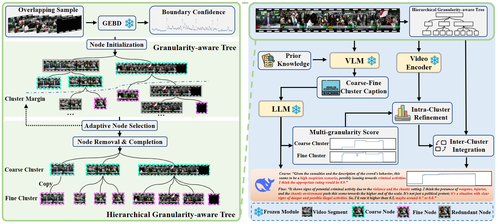

<div align="center">

# VADTree: Explainable Training-Free Video Anomaly Detection via Hierarchical Granularity-Aware Tree

[Wenlong Li](), [Yifei Xu](), [Yuan Rao](), [Zhenhua Wang](), [Shuiguang Deng]() <br>


[](https://arxiv.org/abs/2510.22693)

</div>

<p align="center">
  
</p>
<br>

> **Abstract:** Video anomaly detection (VAD) focuses on identifying anomalies in videos. Supervised methods demand substantial in-domain training data and fail to deliver
clear explanations for anomalies. In contrast, training-free methods leverage
the knowledge reserves and language interactivity of large pre-trained models
to detect anomalies. However, the current fixed-length temporal window sampling approaches struggle to accurately capture anomalies with varying temporal
spans. Therefore, we propose VADTree that utilizes a Hierarchical Granularityaware Tree (HGTree) structure for flexible sampling in VAD. VADTree leverages
the knowledge embedded in a pre-trained Generic Event Boundary Detection
(GEBD) model to characterize potential anomaly event boundaries. Specifically,
VADTree decomposes the video into generic event nodes based on boundary
confidence, and performs adaptive coarse-fine hierarchical structuring and redundancy removal to construct the HGTree. Then, the multi-dimensional priors
are injected into the visual language models (VLMs) to enhance the node-wise
anomaly perception, and anomaly reasoning for generic event nodes is achieved
via large language models (LLMs). Finally, an inter-cluster node correlation
method is used to integrate the multi-granularity anomaly scores. Extensive
experiments on three challenging datasets demonstrate that VADTree achieves
state-of-the-art performance in training-free settings while drastically reducing
the number of sampled video segments. 

# Progress
- [x] `2025-11-30` Experimental results released. 
- [x] `2025-11-27` All code released. 
- [x] `2025-09-19` Paper accepted at NeurIPS 2025. 

# Datasets preparation
The groundtruth for The UCF-Crime, XD-Violence (from [LAVAD](https://github.com/lucazanella/lavad)) and MSAD datasets is already included in the **dataset_info** folder and no additional download is required.  
Only step 1,3,5 requires video data to run.   
You can download the video data from the following official websites:   
 UCF-Crime: [link](https://www.crcv.ucf.edu/projects/real-world/) &emsp;
 XD-Violence: [link](https://roc-ng.github.io/XD-Violence/) &emsp;
 MSAD: [link](https://msad-dataset.github.io/)   
The test video folder structure should be as follows:
```
UCF_CRIME_TEST_VIDEO_DIR (290 videos)
├── Abuse028_x264.mp4
├── Abuse030_x264.mp4
└── ...
```

# Install
### 1. Clone the repository and Install VADTree environment
```bash
git clone https://github.com/wenlongli10/VADTree.git
cd VADTree
conda create --name VADTree python=3.10
conda activate VADTree
pip install -r requirements.txt
```
Now you can use the existing experimental intermediate data (in **result** folder) to perform steps 2, 5, 6, and 7 in VADTree.   
Steps 1, 3, and 4 require configuring the corresponding environments and model weight first.

### 2. Install EfficientGEBD environment and prepare pretrain model weight
You can follow the instructions in [EfficientGEBD](https://github.com/Ziwei-Zheng/EfficientGEBD).

### 3. Install LLaVA-Video-7B-Qwen2 environment and prepare pretrain model weight
You can follow the instructions in [LLaVA-NeXT](https://github.com/LLaVA-VL/LLaVA-NeXT) to install environment.  
LLaVA-Video-7B-Qwen2 weight: [huggingface](https://huggingface.co/lmms-lab/LLaVA-Video-7B-Qwen2)

### 4. Prepare DeepSeek-R1-Distill-Qwen-14B pretrain model weight
You can use LLaVA-Video-7B-Qwen2's environment to run DeepSeek-R1-Distill-Qwen-14B.  
DeepSeek-R1-Distill-Qwen-14B weight: [huggingface](https://huggingface.co/deepseek-ai/DeepSeek-R1-Distill-Qwen-14B)

# Quick Start (Example)
Here we provide a quick start guide to run VADTree on UCF-Crime dataset.
### 1. GEBD boundary extraction
You need to first configure the project environment of EfficientGEBD and the model weight file: GEBD_MODEL_WEIGHT and MODEL_CONFIG
```bash
conda activate EfficientGEBD
cd EfficientGEBD
python GEBD_split100.py \
    --video_dir /path/to/UCF_CRIME_TEST_VIDEO_DIR \
    --resume /path/to/GEBD_MODEL_WEIGHT \
    --config-file /path/to/MODEL_CONFIG \
```

Output:
```
VADTree/result/UCF_Crime_test/EGEBD_x2x3x4_r50_eff_split_out_th0.5
└── pred_scenes_th_0.5.json  # per-frame boundary confidence + scene segments
    └── scenes_th_0.5.json       # scene segments
```

### 2. Build HGTree 
```bash
cd ../  
conda activate VADtree
python HGTree_generation.py \
  --json_path ./result/UCF_Crime_test/EGEBD_x2x3x4_r50_eff_split_out_th0.5/pred_scenes_th0.5.json \
  --threshold kmeans \  
  --gamma 0.4 \         
```

Output:
```
  VADTree/result/UCF_Crime_test/EGEBD_x2x3x4_r50_eff_split_out_th0.5_peak_dfs_kmeans_1_0.4
    ├── pred.json                 # Original per-frame scores (copy)
    ├── dfs_coarse_scenes.json    # Coarse-grained nodes
    ├── dfs_fine_scenes.json      # Fine-grained nodes
    └── dfs_redundant_scenes.json # Redundant nodes
```

### 3. Node-wise VLM captioning (Coarse and Fine)
 You need to first configure the project environment of LLaVA-Video-7B-Qwen2 and the model file: VLM_MODEL_DIR
```bash
conda activate llava
cd LLaVA-NeXT
python infer_VAD.py \
  --pretrained /path/to/VLM_MODEL_DIR \
  --video_root /path/to/UCF_CRIME_TEST_VIDEO_DIR \
  --json_path ../result/UCF_Crime_test/EGEBD_x2x3x4_r50_eff_split_out_th0.5_peak_dfs_kmeans_1_0.4/dfs_coarse_scenes.json \
python infer_VAD.py \
  --pretrained /path/to/VLM_MODEL_DIR \
  --video_root /path/to/UCF_CRIME_TEST_VIDEO_DIR \
  --json_path ../result/UCF_Crime_test/EGEBD_x2x3x4_r50_eff_split_out_th0.5_peak_dfs_kmeans_1_0.4/dfs_fine_scenes.json \
```

Coarse and Fine Output:
```
  VADTree/result/UCF_Crime_test/EGEBD_x2x3x4_r50_eff_split_out_th0.5_peak_dfs_kmeans_1_0.4/
  └── LLaVA-Video-7B-Qwen2_ucf_prior_q_{coarse|fine}/
      └── maxf64_ucf_prior_q_maxf64_ucf_prior_q_Here is a .json       # Node captions (per segment)
```

### 4. Node-wise LLM reasoning (Coarse and Fine)
You need to first configure the model file of DeepSeek-R1-Distill-Qwen-14B: LLM_MODEL_DIR
```bash
cd ../DeepSeek-R1
python deepseek_batch_infer.py  \
    --video_root /path/to/UCF_CRIME_TEST_VIDEO_DIR \
    --ckpt_dir /path/to/LLM_MODEL_DIR \
    --input_json ../result/UCF_Crime_test/EGEBD_x2x3x4_r50_eff_split_out_th0.5_peak_dfs_kmeans_1_0.4/LLaVA-Video-7B-Qwen2_ucf_prior_q_coarse/maxf64_ucf_prior_q_Here is a .json \
python deepseek_batch_infer.py  \
    --video_root /path/to/UCF_CRIME_TEST_VIDEO_DIR \
    --ckpt_dir /path/to/LLM_MODEL_DIR \
    --input_json ../result/UCF_Crime_test/EGEBD_x2x3x4_r50_eff_split_out_th0.5_peak_dfs_kmeans_1_0.4/LLaVA-Video-7B-Qwen2_ucf_prior_q_fine/maxf64_ucf_prior_q_Here is a .json \
```

Coarse and Fine Output:
```
  VADTree/result/UCF_Crime_test/EGEBD_x2x3x4_r50_eff_split_out_th0.5_peak_dfs_kmeans_1_0.4/
  └── LLaVA-Video-7B-Qwen2_ucf_prior_q_{coarse|fine}/
      └── DeepSeek-R1-Distill-Qwen-14B_think/
          └── maxf64_ucf_prior_q_Here is a .json   # Node-wise reasoning scores
```

### 5. Feature similarity (Coarse and Fine)
```bash
conda activate VADtree
cd ../ImageBind
python imagebind_sim.py \
    --video_summary_json ../result/UCF_Crime_test/EGEBD_x2x3x4_r50_eff_split_out_th0.5_peak_dfs_kmeans_1_0.4/LLaVA-Video-7B-Qwen2_ucf_prior_q_coarse/maxf64_ucf_prior_q_Here is a .json \
    --video_root /path/to/UCF_CRIME_TEST_VIDEO_DIR \
python imagebind_sim.py \
    --video_summary_json ../result/UCF_Crime_test/EGEBD_x2x3x4_r50_eff_split_out_th0.5_peak_dfs_kmeans_1_0.4/LLaVA-Video-7B-Qwen2_ucf_prior_q_coarse/maxf64_ucf_prior_q_Here is a .json \
    --video_root /path/to/UCF_CRIME_TEST_VIDEO_DIR \
```

Coarse and Fine Output:
```
  VADTree/result/UCF_Crime_test/EGEBD_x2x3x4_r50_eff_split_out_th0.5_peak_dfs_kmeans_1_0.4/
  └── LLaVA-Video-7B-Qwen2_ucf_prior_q_{coarse|fine}/
      └── sim_maxf64_ucf_prior_q_Here is a .pkl    # Feature similarity cache
```

### 6. Intra-cluster refinement & eval (Coarse and Fine)  
The similarity files will be automatically loaded in this step by score_json.
```bash
cd ..
python refinement_eval.py \
    --score_json result/UCF_Crime_test/EGEBD_x2x3x4_r50_eff_split_out_th0.5_peak_dfs_kmeans_1_0.4/LLaVA-Video-7B-Qwen2_ucf_prior_q_coarse/DeepSeek-R1-Distill-Qwen-14B_think/maxf64_ucf_prior_q_Here is a .json \
python refinement_eval.py \
    --score_json result/UCF_Crime_test/EGEBD_x2x3x4_r50_eff_split_out_th0.5_peak_dfs_kmeans_1_0.4/LLaVA-Video-7B-Qwen2_ucf_prior_q_coarse/DeepSeek-R1-Distill-Qwen-14B_think/maxf64_ucf_prior_q_Here is a .json \
```

Coarse and Fine Output:
```
  VADTree/result/UCF_Crime_test/EGEBD_x2x3x4_r50_eff_split_out_th0.5_peak_dfs_kmeans_1_0.4/
  └── LLaVA-Video-7B-Qwen2_ucf_prior_q_{coarse|fine}/
      └── DeepSeek-R1-Distill-Qwen-14B_think_VxV10_nn10_tao0.1/
          └── refine_maxf64_ucf_prior_q_Here is a .json  # Refined scores and eval results
```

### 7. Inter-cluster correlation & eval
```bash
python correlation_eval.py \
    --coarse_scores_json result/UCF_Crime_test/EGEBD_x2x3x4_r50_eff_split_out_th0.5_peak_dfs_kmeans_1_0.4/LLaVA-Video-7B-Qwen2_ucf_prior_q_coarse/DeepSeek-R1-Distill-Qwen-14B_think_VxV10_nn10_tao0.1/refine_maxf64_ucf_prior_q_Here is a .json \
    --fine_scores_json result/UCF_Crime_test/EGEBD_x2x3x4_r50_eff_split_out_th0.5_peak_dfs_kmeans_1_0.4/LLaVA-Video-7B-Qwen2_ucf_prior_q_fine/DeepSeek-R1-Distill-Qwen-14B_think_VxV10_nn10_tao0.1/refine_maxf64_ucf_prior_q_Here is a .json \
    --beta 0.2 \
```

VADTree final Output:
```
  VADTree/result/UCF_Crime_test/EGEBD_x2x3x4_r50_eff_split_out_th0.5_peak_dfs_kmeans_1_0.4/
  └── LLaVA-Video-7B-Qwen2_ucf_prior_q_coarse/
      └── DeepSeek-R1-Distill-Qwen-14B_think_VxV10_nn10_tao0.1_ENSE_EX234R50ES0.5_peak_dfs_kmeans_1_0.4_LV7Q_ucf_prior_q_DRDQ14_think_VxV10_nn10_tao0.1_beat0.2
         └── ense_refine_maxf64_ucf_prior_q_Here is a .json # Correlation scores and eval results
```

# Citation

Please consider citing our paper in your publications if the project helps your research.
```bibtex
@inproceedings{li2025vadtree,
  title={VADTree: Explainable Training-Free Video Anomaly Detection via Hierarchical Granularity-Aware Tree},
  author={Li, Wenlong and Xu, Yifei and Rao, Yuan and Wang, Zhenhua and Deng, Shuiguang},
  booktitle={The Thirty-ninth Annual Conference on Neural Information Processing Systems},
  year={2025}
}
```

# Acknowledgements

This repository builds upon the [LAVAD](https://github.com/lucazanella/lavad). Thanks to the authors!